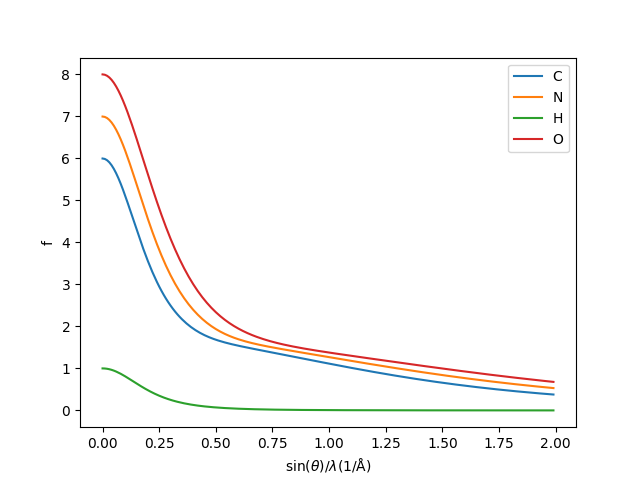

# Scatter

Scatter is a simple tool for plotting atomic scattering factors. To run:

    scatter Si O

will plot the scattering factors for Si and O. The `--table` command can be used to switch between electron/xray scattering factor tables.

    scatter --help

will show the help file.

## Requirements

- Python 3.9+
- Numpy
- Matplotlib

## Installation

Directly from github:

    pip install git+https://github.com/stefsmeets/scatter

Or download and extract:

https://github.com/stefsmeets/scatter/archive/master.zip

And install using:

    pip install .

